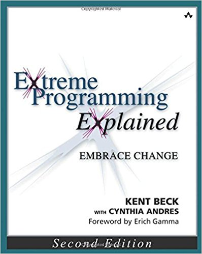

# Configuration Management with Spring Boot and PCF

Application demonstrating Internal and External Configuration management with Spring Boot and PCF for both Sensitive and non-Sensitive Data.

A variety of options are available for configuration management with varying levels of support, features, and costs including:
- Ability to update variables *without* deployable artifact changes
- Ability to update variables *without* application restarts
- Ability to track / audit changes to config variables
- Ability to share config with different application

Pick the right options for your business needs, default to simplicity, and don't store sensitive data (passwords) in SCM. 

## On Simplicity and Picking the Right Solution

**Quotes from the Book: Extreme Programming Explained: Embrace Change by Kent Beck**



*Simplicity is the most intensely intellectual of the XP values. To make a system simple enough to gracefully solve only today’s problem is hard work.* 


*If someone asks me whether I want the Ferrari or the minivan , I choose the Ferrari . It will inevitably be more fun . However , as soon as someone says , “ Do you want the Ferrari for $ 150,000 or the minivan for $ 25,000 ? ”*
*I can begin to make an informed decision . Adding new constraints like “ I need to haul five children ” or “ It has to go 150 miles per hour ” clear the picture further . There are cases where either decision makes sense . You can’t make a good decision based on image alone . To choose a car wisely you need to know your constraints , both cost and intended use . All other things being equal , appeal comes into play .*

*It’s easy to get carried away programming and put in code “ just in case . ” By stating explicitly and objectively what the program is supposed to do , you give yourself a focus for your coding .*

## Configuration Options  

# 1. Properties Files

Variables can be injected from application.properties files using the *Value* Annotation.

Note the support for default values, for example:

```java
@Value("${application.greeting.message:hello from default}")
private String greetingMessage;

```

# 2. Environment Variables

## Locally 

For testing purposes, environment variables can be injected at spring-boot:run time.

```sh
mvn spring-boot:run -Dapplication.greeting.message="Hello from commandline"
```

## On PCF

Environment variables can be updated in PCF in a variety of ways including via GUI, Manifest, and commandline.

To update via the GUI (AppsMan), configuration is under Application Settings -> User Provided Environment Variables. 

To update via the commandline run:

```sh
cf set-env config-demo application.greeting.message "Greetings from PCF env variable"
```

This option can be used for sensitive data such as passwords, preventing them from being available in Source Code, and the Deployable Artifact.

## Note the Order of Precedence 
https://docs.spring.io/spring-boot/docs/current/reference/html/boot-features-external-config.html 

# 3. Spring Profiles 

In addition to application.properties, Spring will load additional application-XX.properties files based on the spring.profiles.active environment variable.

In PCF, this is set to **cloud** by default, meaning application-cloud.properties will be loaded as well. 

To test this locally:
```sh
mvn spring-boot:run -Dspring.profiles.active=qa
```

Example for setting it in a PCF manifest file:

```yaml
applications:
- name: config-demo
  path: target/config-demo-0.0.1-SNAPSHOT.jar
  env:
    SPRING_PROFILES_ACTIVE: qa

```

> Tip - that you can have multiple Active properties enabled

# 4. Marketplace Services 

For storing passwords to Services available in the CF Marketplace, consider just using the Service Binding for password management. 

To view available services:

```sh
cf marketplace
```

# 5. Custom User Provided Services (CUPS)

For Services not available in the CF Marketplace, and where you don't want to use environment variables, and potentially you want to share services between application consider Custom User Provided Services (CUPS).

https://docs.cloudfoundry.org/devguide/services/user-provided.html

This will emulate a Service for you in CF, though you will still be responsible for updating your code to load and use the credentials.

To create the Service:

```sh
cf cups my-custom-service -p '{"username":"admin","password":"pa55woRD"}'
```

You will also need to bind the Service to your application:

```sh
cf bind-service config-demo my-custom-service
```

This setting can then be loaded via VCAP environment variables in your source code, for example:

```java
@Value("${vcap.services.my-custom-service.credentials.username:#{null}}")
private String customServiceUsername;
```

> TIP - not the usage of #{null} to set the default to an actual Null value instead of a String containing Null

# 6. Config Server

You can also externalize configuration using an external Config Server.

One should be available in the CF Marketplace. 

```sh
cf marketplace
```

To create it, run: 
```sh
cf create-service -c '{ "git": { "uri": "https://github.com/vicsz/configuration-server-config-repo", "label": "master" } }' p-config-server trial my-config
```

> Note - the custom GIT Url which can be configured 

Bind the service to your application and restart:

```sh
cf bind-service config-demo my-config
```

You will also need to ensure that the *Spring Cloud Client* dependency is added to your application.

> Tip - Configuration variables additionally be encrypted

https://docs.run.pivotal.io/spring-cloud-services/config-server/configuring-with-git.html

> Tip - An alternate underlying data store for the Config Server is Hashicorp Vault

https://docs.run.pivotal.io/spring-cloud-services/config-server/configuring-with-vault.html

Configuration requests use one of the following path formats:

```text
/{application}/{profile}[/{label}]
/{application}-{profile}.yml
/{label}/{application}-{profile}.yml
/{application}-{profile}.properties
/{label}/{application}-{profile}.properties
```

> Note - it's NOT in the format of "application.properties" but appname.properties (i.e. config-demo.properties)

More advanced PCF Configuration Example available at: (including encryption and file usage)

https://github.com/spring-cloud-services-samples/cook

## Spring Boot Config Client 

You will need the spring-cloud-services-starter-config-client dependency instead of the spring-cloud-starter-config one.

Your pom.xml will need : 
```xml
<dependency>
    <groupId>io.pivotal.spring.cloud</groupId>
    <artifactId>spring-cloud-services-starter-config-client</artifactId>
</dependency>

```

In Spring Intitalizer for a PCF Config Server Client, make sure you select the **Config Client (PCF)**  (under Pivotal Cloud Foundry in Full Version )instead of Config Client. 

# 8. Refreshing Config Values

A restart will always cause to reload of values from Vault.

Example:

```sh
cf restage config-demo
```

For re-loading values without a restart, you can use the refresh actuator endpoint.

This will require the Actuator Spring Boot Dependency, and the refresh endpoint exposed (see application.properties file).

Also note the required addition of the RefreshScope annotation in the WebController.

To force a reload of values, the refresh endpoint needs to be hit: 

```sh
curl -X POST http://localhost:8080/actuator/refresh
```

Note that this will only call **ONE** instance, and not update the other ones (if you have more then one instance load balanced).

One workaround for this is Spring Cloud Bus:

https://www.baeldung.com/spring-cloud-bus

# 7. Vault via PCF

In addition to using a Config Server with a Vault Backend, you can also use a Vault Service Broker and the Spring Cloud Vault client library. 

Demo available at : https://github.com/vicsz/spring-vault-demo

Additional information available:

https://www.hashicorp.com/blog/cloud-foundry-vault-service-broker
https://github.com/hashicorp/vault-service-broker

> Note - that secrets can also be shared across Spaces and Organizations

## Running the Application

### Deploy to PCF

Build the application:

```sh
./mvn package
```

Deploy to PCF using the CLI:

```sh
cf push
```

> Use --no-route in case of conflicting routes.
